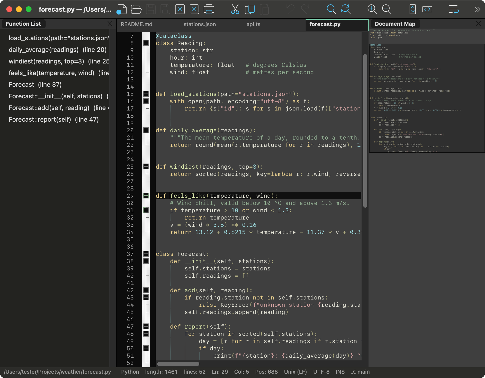
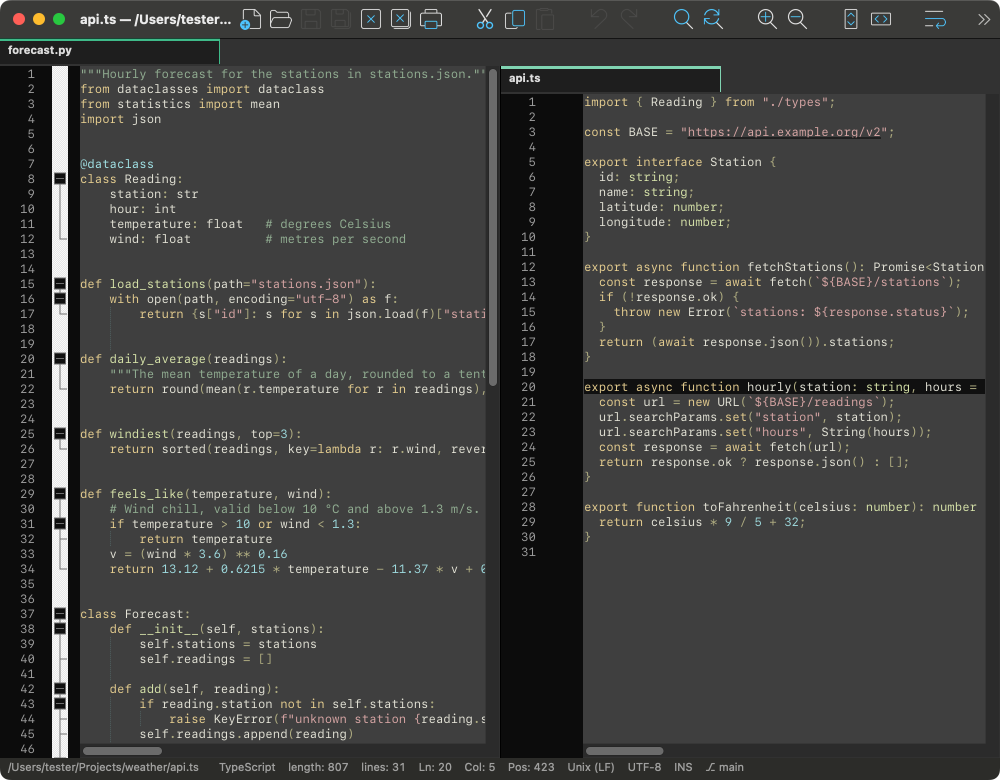
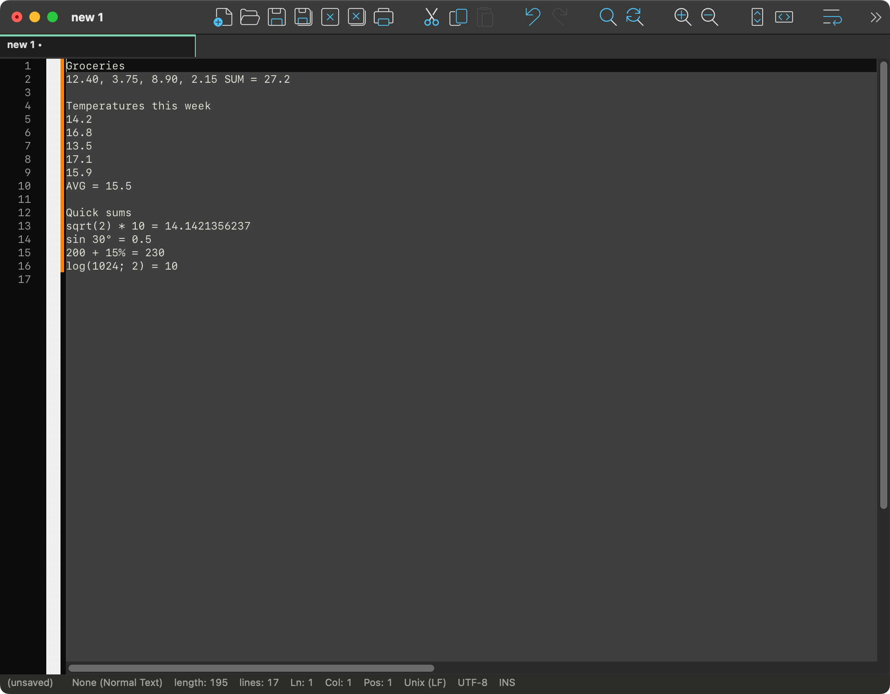
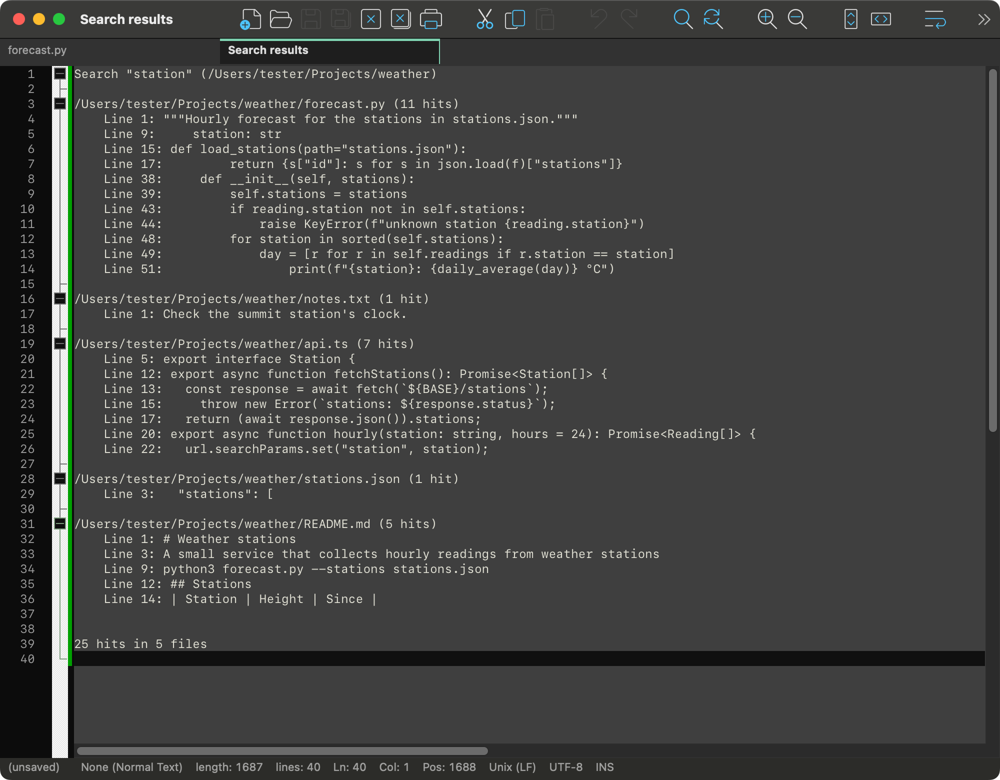
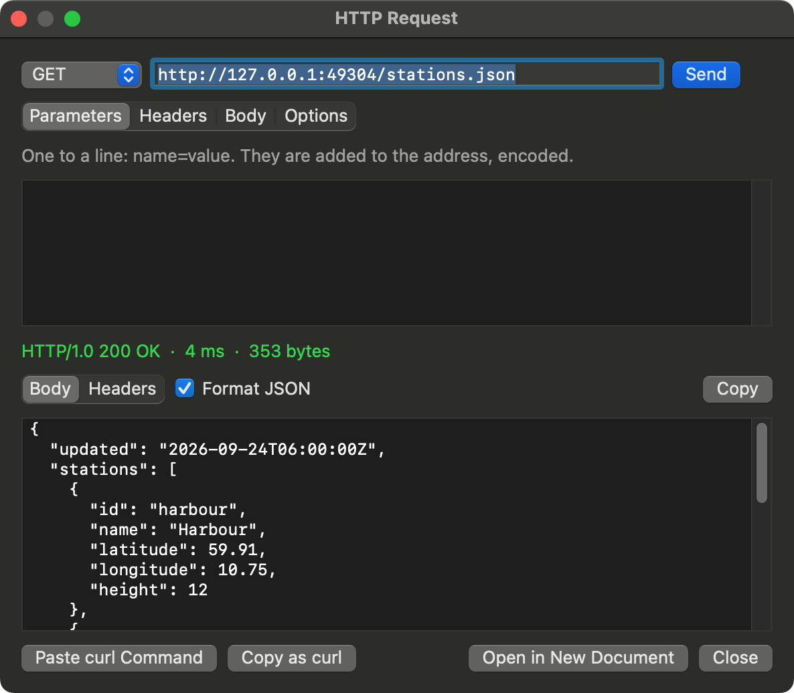
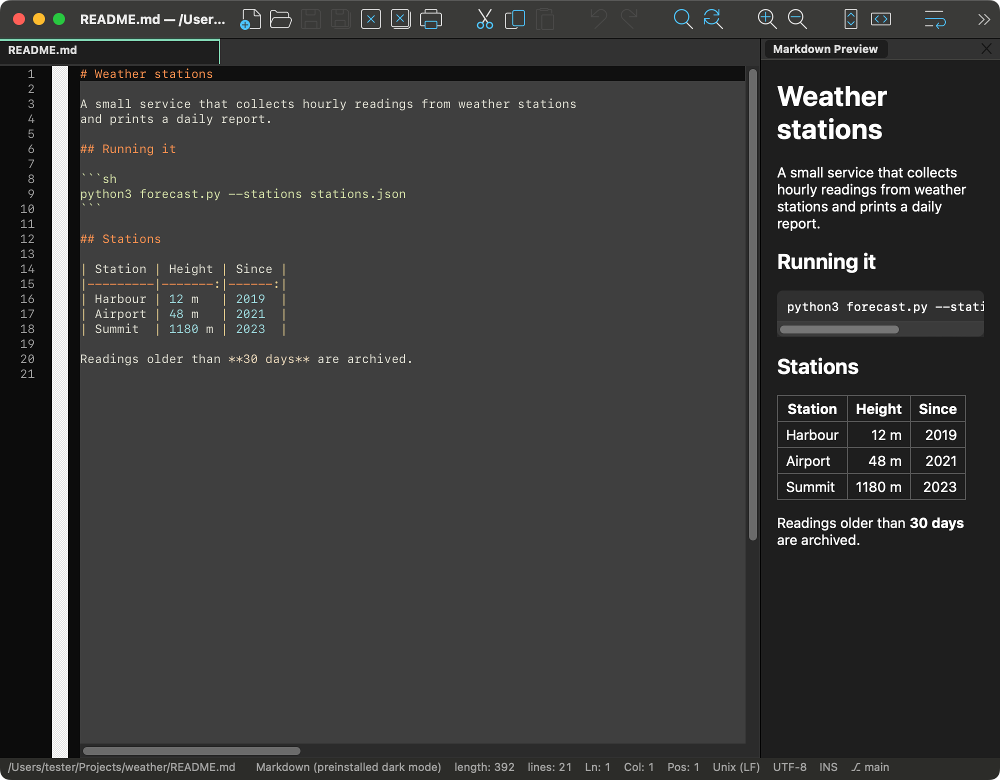
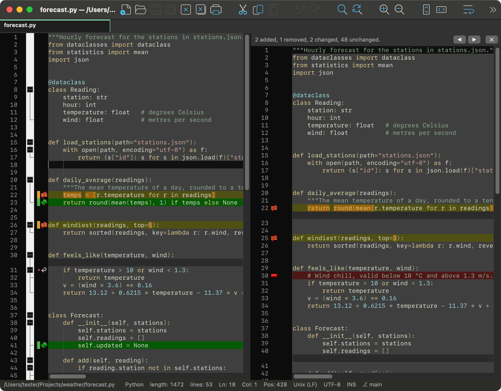
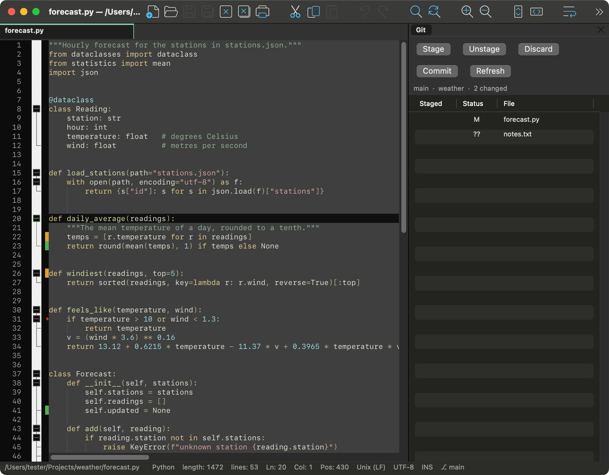
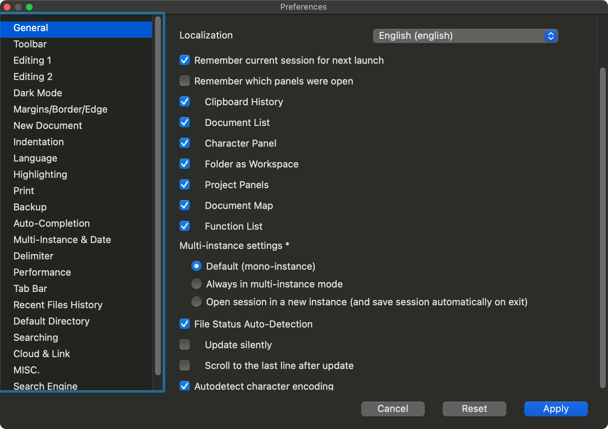

# Notepad++ for macOS

[](https://github.com/tanderbold/NotepadMac/releases/latest)
[](https://github.com/tanderbold/NotepadMac/releases)
[](https://github.com/tanderbold/NotepadMac/actions/workflows/macos.yml)
[](LICENSE)
[](https://github.com/tanderbold/NotepadMac/releases/latest)
[](https://github.com/tanderbold/NotepadMac/releases/latest)
[](https://github.com/tanderbold/homebrew-tap)

A native macOS port of Notepad++: the same
editing engine (Scintilla), the same syntax highlighting (Lexilla), the same
language, colour, theme, function-list and translation files as the Windows
version - in a Cocoa application that runs on Apple silicon and Intel Macs.
No Wine, no emulation, no Windows code.



> An independent, unofficial port. It is not made, released or supported by the
> Notepad++ project: **questions, bug reports and requests about the Mac version
> belong in the Issues and Discussions of this repository**, not upstream's
> forum, site or e-mail. Releases of the Mac version are made and signed here.
> Same licence as Notepad++: GPL.

## What you get

**All 579 commands of the Windows menus** are implemented (the list is generated
from the Windows menu resource, see [macos/FEATURES.md](macos/FEATURES.md)), and they behave
the way they do on Windows - the port is written against Notepad++'s own sources.

**Editing**
- Tabs, two views side by side, each with its own tabs (move or clone a document to the other view), drag and pin tabs, tab colours, a vertical tab bar.
- Multi-selection and column mode, Column Editor, Begin/End Select, line operations (sort seven ways, remove duplicates, join, split, move), case conversions, trim and tab/space conversion, comment toggling, date/time insertion.
- Auto-completion of words, functions and paths with parameter hints; auto-close of brackets, quotes and HTML tags; smart highlighting; brace and XML-tag matching.
- Bookmarks with line operations, five mark styles, Change History, code folding, hidden lines.
- Macros: record, play, run many times, save with a shortcut - including menu commands and searches, in the Windows `shortcuts.xml` format.
- Clipboard History, Character Panel, paste as HTML / RTF / binary.
- **[Selected numbers](https://tanderbold.github.io/NotepadMac/numbers.html)**: select a set of numbers - `3, 1, 2`, `3 1 2`, one per line, or a column - and Selected Numbers (context menu, or Edit > Selected Numbers) writes their sum, average, minimum, maximum or count after them (`30, 4, 100 SUM = 134`; under them for numbers one per line) and sorts them either way in place, each number keeping its own spelling and every separator staying where it was. Decimal arithmetic (0.1 + 0.2 is 0.3); a decimal comma (`1,5 2,25`) is understood.
- **[Calculate](https://tanderbold.github.io/NotepadMac/numbers.html#calculate)** (Edit menu, ⌘=, and the context menu): a formula's value written after its `=` - the selected formula, or the one just typed (`2 + 3 =` ⌘= gives `2 + 3 = 5`; without the `=` it is added). `+ - * / : ^`, `mod`, `n!`, percent as a calculator has it (`200 + 15%` is 230), and functions: `sin cos tan cot` and their inverses and hyperbolics, `sqrt cbrt exp ln log lg log2`, `log(x; base)`, `root(x; n)`, `abs floor ceil round`, `min max gcd lcm`; `pi`, `e`; `°` for degrees (`sin 30° = 0.5`). Decimal arithmetic, ten decimal places. ⌘= is Calculate's; Zoom In is ⌘+ (⇧⌘=), ⌘-scroll or a pinch.

<p> </p>

**Languages**
- Syntax highlighting and folding for about 90 languages, from Notepad++'s own `langs.model.xml` and `stylers.model.xml`; all upstream themes; the Style Configurator.
- User Defined Languages: the full editor, and UDL files from Windows work as they are.
- Function List for every language upstream has a parser for (run with PCRE2, as written), Document Map, Document List, Folder as Workspace, Project panels - dockable, floatable, remembered.
- **The language of a text is worked out from its contents** when its name says nothing - a file without an extension, a snippet pasted into an empty tab - by a small model trained on real code, which offers one language or a short list.

<p></p>

**Search**
- Find, Replace, Find in Files, Find in Projects, Mark, incremental search, with Notepad++'s regular-expression syntax (Boost), the results panel - folding, and a double-click on a hit opens its file at that line - and search-result colours.

**Files and encodings**
- UTF-8/16 with and without BOM, ANSI, all 46 of Notepad++'s character sets as "Encode in" and "Convert to", encoding detection, EOL conversion.
- Sessions, periodic backup and snapshot of unsaved documents, file-change monitoring (tail -f), large-file handling, read-only, print.
- `session.xml`, `shortcuts.xml`, `contextMenu.xml`, UDL and theme files are read and written in the Windows formats, so a settings folder can be carried over.

**Tools**
- **Hashes**: MD5, SHA-1, SHA-256, SHA-512 as upstream, plus SHA-224, SHA-384, SHA3-256, SHA3-512, BLAKE2b, CRC-32 and an optional HMAC key; **bcrypt, scrypt, Argon2 and PBKDF2** with their settings, salts, and a verifier. Each: of a text (or each line), of files, of the selection into the clipboard.
- **Base**: Base64 (and URL-safe), Base58 (and Base58Check), Base32 - from text or bytes in hexadecimal, and back to both.
- **Password Generator**: length, character sets, look-alikes excluded, entropy shown, drawn from the system's secure random generator without bias; optionally the hash of each password.
- **HTTP Request**: method, address, parameters, headers, body, Basic authentication, redirects, timeout; the answer's status, headers and body (JSON laid out), opened as a document if wanted; **Paste curl Command** and **Copy as curl**.
- **QR codes, both ways**: the selection as a QR code (copy or save the picture), and the clipboard's QR code back as text.

<p> </p>

**Only a Mac could**
- **`nppmac` command line**: `nppmac file.txt`, `nppmac +42 file.txt`, `echo hi | nppmac -`, a folder opens as a workspace; Tools > Install Command Line Tool links it into /usr/local/bin.
- **Paste Image as Text**: the clipboard's image read by the system's text recognizer, straight to the caret; **Recognize Text in File** reads a whole image or PDF, page by page, into a new document.
- **Spell checking** on the system engine and **Markdown Preview** (listed with the plugins below) are system-native too.
- **An MCP server for AI coding agents**: `nppmac mcp` gives Claude Code, Cursor and the like the editor's open documents, unsaved text, selection, lexer tokens, searches, Compare and more as tools (see [Working with AI agents](#working-with-ai-agents-mcp)). Off until turned on in Preferences.

**Built in instead of plugins** (Windows plugins are Windows binaries and cannot load)
- JSON: format, compact, sort keys, validate, tree.
- Compare, on the engine of the ComparePlus plugin: both panes aligned, changed lines with their changed characters marked, added, removed and moved lines, the symbols in the margin; the comparison follows your typing, a bar above the other pane carries the summary and the navigation, an arrow beside each difference puts it back, and Escape leaves.
- XML tools: pretty print, linearize, validate (DTD/XSD), XPath, XSLT.
- FTP/FTPS client panel.
- NppExec-compatible scripting: a console, scripts, variables, its commands.
- **Git**: the lines changed since the last commit marked in the margin as you type, the branch in the status bar, a panel of the repository's changed files with stage / unstage / discard, Compare with HEAD, Blame and File History as documents, Commit, Switch Branch and New Branch, Fetch / Pull / Push into the console. Windows Notepad++ has plugins for this; here it is built in, driving the `git` of the Command Line Tools.
- MIME Tools: Quoted-printable, URL encoding, SAML decode (its Base64 lives in Tools > Base already).
- Converter: ASCII/HEX both ways and a Conversion Panel (decimal, hex, binary, octal, character).
- Export: the styled text as RTF or HTML - to a file, or to the clipboard so a paste keeps the colours.
- Spell checking on the system engine: squiggles as you type (in code: comments and strings only), suggestions in the context menu, every installed dictionary.

- Markdown Preview: the document rendered live in a docked panel (CommonMark + tables), as MarkdownViewer++ does.

<p> </p>

**Plugins of your own**: native plugins load from the plugins folder the way they do
on Windows — a small C interface, Scintilla messages and all. See
[Writing a plugin](#writing-a-plugin) below.

**Interface**
- The interface in any of Notepad++'s ~90 translations, chosen in Preferences; what only the Mac version says is translated too.
- Preferences with Notepad++'s pages and wording, Shortcut Mapper (menu, macro, run and Scintilla commands, conflicts shown), editable context menu, toolbar with upstream's icon sets, dark mode.
- Mac conventions where Windows ones make no sense: Finder and Terminal for Explorer and cmd, the Trash for the Recycle Bin, ⌘ shortcuts.

<p></p>

## Differences from the Windows version

- **Windows plugins (`.dll`) do not run** and cannot: they are Windows binaries. The most used
  ones are built in instead (JSON, Compare, XML tools, FTP, NppExec scripting, MIME Tools, Git), and
  native Mac plugins can be written against [macos/plugin-sdk](macos/plugin-sdk/README.md);
  Plugins Admin is absent.
- Mac conventions replace Windows ones: Finder and Terminal instead of Explorer and cmd, the Trash
  instead of the Recycle Bin, the system menu bar and dark appearance, ⌘ shortcuts.
- Where macOS keeps a Windows shortcut for itself, the Mac one differs: Block Comment is ⌥⌘/ (Ctrl+Shift+Q
  is Log Out, and ⇧⌘/ is the Help menu's search), and Zoom In is ⌘+ because ⌘= is Calculate. All of
  them can be changed in the Shortcut Mapper.
- Settings that only make sense on Windows are left out (tray icon, DirectWrite modes, hiding the
  menu bar, custom dark-mode tones).
- A font a theme names but the Mac lacks - Consolas, the Windows default, comes only with Microsoft Office - is shown in the system's monospaced font (SF Mono), so columns still line up; the setting keeps the name.
- Docked panels can be moved between four sides, tabbed and floated, but not nested as freely as on Windows.
- Texts that only the Mac version has are translated by machine and not yet reviewed by native speakers.

## Install

With [Homebrew](https://brew.sh):

```
brew install --cask tanderbold/tap/notepadmac
```

Or download the `.dmg` from this repository's **Releases** page (or, for the very latest
build, from the newest successful run of the *macOS* workflow: Actions tab → run →
Artifacts), open it and drag **NotepadMac** to Applications.
Requires macOS 11 or later; one build runs on Apple silicon and Intel.

Releases are signed and notarised. Builds taken straight from CI are not, so for those,
the first time: right-click the app → **Open** → **Open** (or System Settings → Privacy &
Security → *Open Anyway*).

Settings live in `~/Library/Application Support/NotepadMac/` and in the
`org.notepad-plus-plus.mac` preferences domain.

## Writing a plugin

NotepadMac loads native plugins the way Notepad++ loads DLLs on Windows: a
plugin is a dynamic library with a small C interface —
[macos/plugin-sdk/NotepadMacPlugin.h](macos/plugin-sdk/NotepadMacPlugin.h),
Notepad++'s `PluginInterface.h` translated to macOS. If you have written a
Notepad++ plugin, you already know it; if not, this is the whole of one:

```c
// myplugin.c — one menu command that writes into the document.
#include "NotepadMacPlugin.h"
#define SCI_REPLACESEL 2170               /* any Scintilla message works */

static NppMacData npp;

static void sayHello(void) {
    npp.send(npp.scintillaHandle, SCI_REPLACESEL, 0, (intptr_t)"Hello from my plugin!");
}

static NppMacFuncItem items[] = { { "Say Hello", sayHello } };

void nppmac_setInfo(NppMacData data) { npp = data; }
const char *nppmac_getName(void) { return "MyPlugin"; }
NppMacFuncItem *nppmac_getFuncsArray(int *count) { *count = 1; return items; }
```

Build it and put it where plugins live (*Run > Open Plugins Folder* opens it):

```sh
clang -dynamiclib -I path/to/macos/plugin-sdk -o MyPlugin.dylib myplugin.c
mkdir -p ~/Library/Application\ Support/NotepadMac/plugins/MyPlugin
cp MyPlugin.dylib ~/Library/Application\ Support/NotepadMac/plugins/MyPlugin/
```

Restart NotepadMac: a **MyPlugin** submenu appears in the Plugins menu, and
*Say Hello* types into the document. From there the whole editor is yours:
`send(scintillaHandle, SCI_*, …)` is the complete Scintilla API, documented at
scintilla.org and identical to what Windows plugins use;
`send(nppHandle, NPPM_*, …)` answers application-level questions (current file
path, open a file, save, a config folder of your own), and
`nppmac_beNotified` hears the application's life (file opened, saved, buffer
activated, shutdown). Any language that can export C symbols from a dylib
works — C, C++, Objective-C, Swift (`@_cdecl`), Rust (`#[no_mangle]`).
The full reference, sample plugin and signing notes are in
[macos/plugin-sdk/README.md](macos/plugin-sdk/README.md).

## Working with AI agents (MCP)

NotepadMac can be a [Model Context Protocol](https://modelcontextprotocol.io) server, so an
AI coding agent on the same Mac works *with* the editor instead of past it: it sees which
documents are open and what is selected, reads unsaved text, edits a buffer as one undo
step, puts the caret where it is talking about, bookmarks lines, shows a Compare, and
uses the editor's own engines for what an agent otherwise has to guess at.

1. Preferences > MISC. > **Let AI agents drive the editor (MCP)**. It is off until you
   turn it on; the application then listens on a socket that only your own processes can open
   (`~/Library/Application Support/NotepadMac/agent.sock`, mode 0600). Nothing goes over the
   network.
2. Point the agent at `nppmac mcp` (Tools > Install Command Line Tool puts `nppmac` in
   `/usr/local/bin`). Claude Code:
   ```
   claude mcp add notepadmac -- nppmac mcp
   ```
   Any other MCP client: a stdio server, command `nppmac`, argument `mcp`. The tool starts
   the application if it is not running.

The 21 tools, in the words the agent sees them:

| Tool | What it gives the agent |
|---|---|
| `list_documents`, `get_document`, `get_selection` | the open tabs, a document's text as it is now (unsaved changes included, by line range), the selection and caret |
| `open_document`, `close_document`, `go_to`, `edit_document`, `save_document`, `bookmarks` | a file or a text in a tab, the caret or a selection put on a line, edits as one undoable step, bookmarks on the lines to look at |
| `list_commands`, `run_command` | any of the 579 menu commands by its Notepad++ name (`IDM_EDIT_UPPERCASE`) or menu path |
| `detect_language` | the language of a text, by what it declares and by the trained model, with confidence |
| `tokens` | the document as its lexer colours it: style names per run of text, and fold levels - what an unclosed string or a User Defined Language really does |
| `function_list` | the functions and classes upstream's Function List parsers find |
| `find`, `replace` | Notepad++'s search: normal, extended or regex (Boost syntax), in a document or in files; a bad expression comes back with the engine's reason |
| `compare` | the line-by-line difference of two documents, files or texts, and optionally the Compare view for the user |
| `file_encoding` | BOM, uchardet's character set, UTF-16 without a mark, line endings, a decoded preview |
| `ocr`, `read_qr` | the text of an image or PDF, the contents of QR codes, by the system's engines |
| `spell_check` | misspelled words with suggestions from the system's spelling engine |

The editor's own commands work for agents too: select with `go_to`, then `run_command` `Edit|Calculate` writes a formula's value after its `=`, and `Edit|Selected Numbers|Sum` (Average, Minimum, Maximum, Count, Sort Ascending/Descending) works on selected numbers ([reference](https://tanderbold.github.io/NotepadMac/numbers.html#for-ai-agents-mcp)).

Quitting the application and moving files to the Trash are not offered to agents.
Windows Notepad++ has no MCP server; this is the port's own.

## Build it yourself

Only Apple's Command Line Tools are needed (`xcode-select --install`) - no Xcode
project, no Homebrew packages.

```
git clone <this repository> NotepadMac && cd NotepadMac
bash macos/build.sh                          # universal app in macos/build/NotepadMac.app
NPPMAC_ARCH=native bash macos/build.sh       # this Mac's architecture only, about twice as fast
bash macos/test.sh                           # the test suite (runs inside the real application)
bash macos/package.sh                        # macos/build/*.dmg
open macos/build/NotepadMac.app
```

To sign and notarise a release, set `NPPMAC_SIGN_IDENTITY="Developer ID Application: … (TEAMID)"`
and `NPPMAC_NOTARY_PROFILE=<profile made with xcrun notarytool store-credentials>` before
`package.sh`.

## How it is made

- Upstream's `scintilla/` and `lexilla/` are compiled unchanged (two portability fixes in `LexUser.cxx`);
  `PowerEditor/` is not compiled at all - it is the specification the Mac code is written against,
  and the source of the data files and generated tables.
- The Mac application is about 45,000 lines of Objective-C++ in `macos/app/`, besides its tests.
- A suite of over 1,000 checks runs inside the real application on every push (GitHub Actions,
  macOS runner): every menu command, file formats against files written on Windows, encodings,
  regular expressions, cryptography against published vectors, the HTTP and FTP clients against
  local servers, the interface in another language with no text cut off.
- [AGENTS.md](AGENTS.md) is the technical briefing - how to build, test and find one's way in
  the code, and how the language-detection model is trained. It is written for AI coding agents
  and reads just as well for people.

## Questions, bugs, contributing

Use this repository's **Issues** for bugs and requests and **Discussions** for questions.
Please do not take problems with the Mac version to the Notepad++ project - they did not
make it and cannot fix it.

Bug reports with a file or steps that show a difference from Windows Notepad++ are the most
useful kind. Translations of the Mac-only texts are machine-made and need native speakers:
see `macos/resources/nativeLang-extra/README.md`. Code changes come with a test in
`macos/app/Tests.mm` and keep `bash macos/test.sh` at `0 failed`.

## Credits and licence

This port stands on other people's work, used under their licences and gratefully acknowledged:
Notepad++ by Don Ho and its contributors (GPL) - the design, the data files, the translations and
the behaviour this application follows; Scintilla and Lexilla by Neil Hodgson and contributors;
uchardet; the Argon2 reference implementation (CC0); the ComparePlus plugin by Jean-Sebastien Leroy
and Pavel Nedev (GPL), whose engine is Compare here (`macos/third_party/compareplus`). "Notepad++" is the name of the original
Windows application; the Mac application is called NotepadMac. Everything in `macos/` is
licensed under the GPL version 3, like Notepad++ itself (see `LICENSE`; Notepad++'s own copyright
notice is in `NOTEPAD-PLUS-PLUS-COPYING.txt`).

`PowerEditor/`, `scintilla/`, `lexilla/` and `boostregex/` are a snapshot of upstream Notepad++,
kept as the sources the application is built from and the reference it is written against;
[UPSTREAM.md](UPSTREAM.md) says which version and what was changed.
